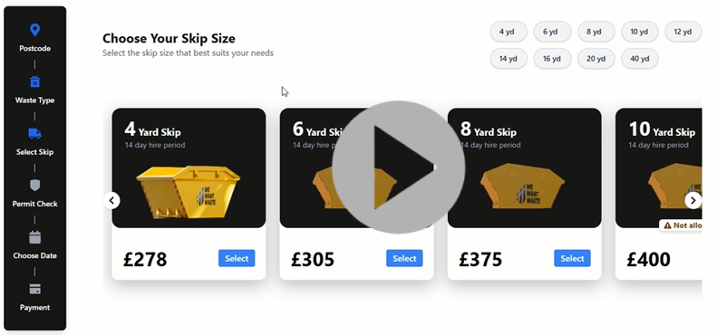

# Skip Hire UI

A modern and responsive skip hire booking interface built using **React**, **JavaScript**, **Tailwind CSS**, and **Vite**. This application provides an interactive UI to browse, select, and proceed with skip bookings using data fetched from a remote source.

---

## 📽️ Desktop View

[](https://drive.google.com/file/d/1CY61hgmEj9X1x_x9Ck9dh6BQ0kaue0nv/view?usp=sharing)

---

## 🚀 Key Features

- **Skip Selection with Interactive Cards**  
  Skips are shown as horizontal scrollable cards with size-based details. Cards can be scrolled using:
  - Arrow buttons  
  - Keyboard keys  
  - Touchpad or swipe gestures

- **Skip Card Selection Behavior**  
  - On selecting a skip card:
    - It expands and centers in the viewport  
    - `Select` button is replaced with `Back` and `Continue` buttons  
    - `Back` navigates to the previous page  
    - `Continue` navigates to the next page (`Permit Check`)

- **Sidebar Navigation**  
  - Sidebar displays navigation links  
  - Navigation buttons show current progress  
  - Future page icons are set to be disabled but remain clickable for testing (commented logic included)

- **Quick Skip Size Panel**  
  A fast-access panel that allows users to jump to a specific skip size, which:
  - Highlights the relevant skip card  
  - Automatically triggers the selection behavior

- **Price Display**  
  - Skip prices are extracted from the API using the `price_before_vat` field  
  - VAT and transport costs are not included in the shown price

- **Dynamic Skip Images**  
  - Skip images are rendered based on size using an image map

- **Responsive Design**  
  - Fully optimized for mobile and desktop  
  - Touch-friendly interactions

---

## 🛠 Tech Stack

- **React** – Frontend framework  
- **JavaScript** – Core logic  
- **Tailwind CSS** – Utility-first responsive styling  
- **Vite** – Development server and build tool

---

## 🔗 Data Source

All skip details are dynamically fetched from a remote data endpoint:  
[https://app.wewantwaste.co.uk/api/skips/by-location?postcode=NR32&area=Lowestoft](https://app.wewantwaste.co.uk/api/skips/by-location?postcode=NR32&area=Lowestoft)

---

## Getting Started

### 1. Clone the Repository

```bash
git clone https://github.com/your-username/skip-hire-ui.git
cd skip-hire-ui
```

### 2. Install Dependencies

```bash
npm install
```

### 3. Run the App

```bash
npm run dev
```
